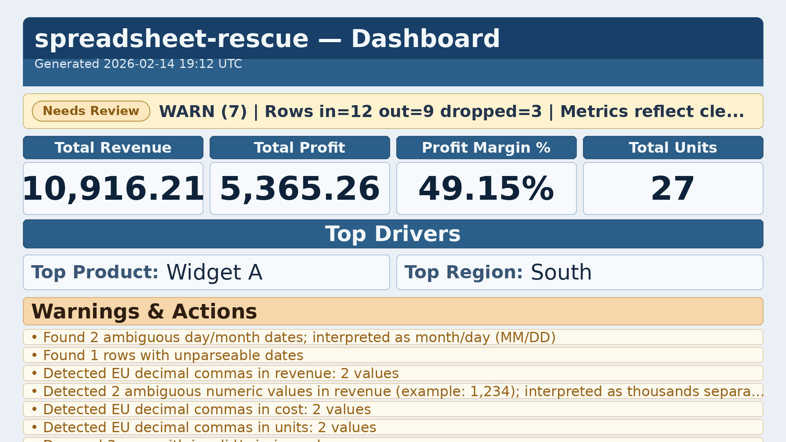
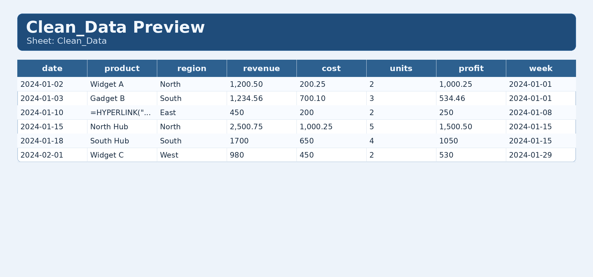
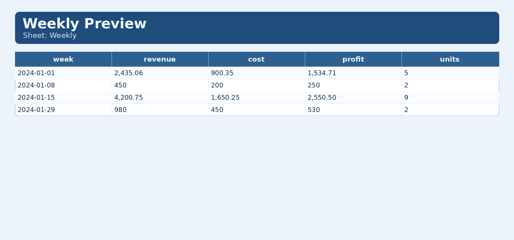

# Demo Walkthrough (2 minutes)

## 1) Input file

`demo/input/messy_sales.csv` (snippet):

```csv
 Order Date , Product Name , Sales Region , Gross Revenue , Cost (€) , Units Sold 
01/02/2024,Widget A,North,"1.200,50","200,25","2,0"
2024-01-03,Gadget B,South,"1,234.56",700.10,3
02/01/2024,Widget C,West,"980,00","450,00","2,0"
2024/01/10,"=HYPERLINK(""https://example.com"",""Click"")",East,450,200,2
```

This dataset includes ambiguous dates, mixed numeric locales, non-standard headers, and formula-like text.

## 2) Run one command

```bash
./scripts/demo.sh
```

## 3) Output artifacts

- `demo/output/Final_Report.xlsx`
- `demo/output/qc.json`
- `demo/output/manifest.json`
- `demo/dashboard.png`
- `demo/clean_data.png`
- `demo/weekly.png`

## 4) Proof images

### Dashboard



### Clean_Data preview



### Weekly preview



## 5) What to show in a live demo

- `Dashboard`: KPI cards + warning summary
- `Clean_Data`: typed values + formula-safe output
- `Weekly`: grouped totals by week
- `qc.json` and `manifest.json`: trust/audit trail
